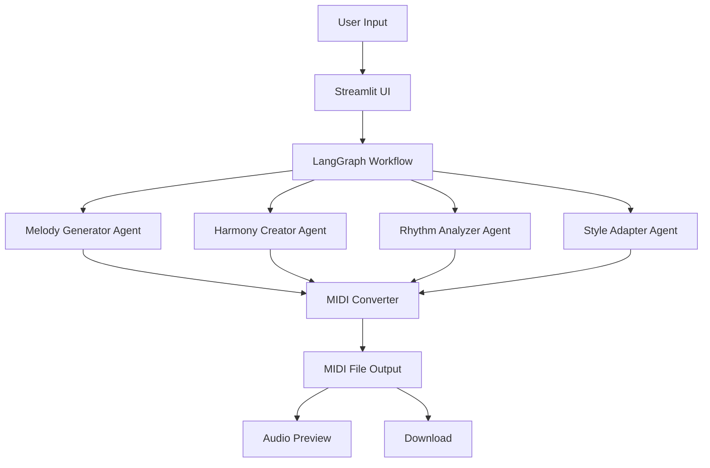

# 🎵 AI Music Composer with LangGraph

An intelligent AI-powered music composition system that uses LangGraph to orchestrate multiple AI agents working together to create original music compositions based on text descriptions.


## 🎥 Project Demo

<!-- Replace the YouTube link with your actual video once you have it -->
[]

*Click the image above to watch the project in action!*

## ✨ Features

- **🤖 Multi-Agent Architecture**: LangGraph orchestrates specialized AI agents for melody, harmony, rhythm, and style
- **🎼 Intelligent Composition**: Generates original music based on text descriptions
- **🎹 Multiple Styles**: Supports Classical, Romantic, Jazz, Cinematic, Electronic, and more
- **💾 MIDI Export**: Download compositions as MIDI files for use in DAWs
- **🎵 Music Theory Integration**: Uses music21 library for proper music theory compliance
- **🌐 Web Interface**: Beautiful Streamlit frontend for easy interaction

## 🏗️ System Architecture



## 🚀 Quick Start

### Prerequisites

- Python 3.8+
- Groq API account ([Sign up here](https://console.groq.com/))
- Basic understanding of music theory (optional)

### Installation

1. **Clone the repository**
   ```bash
   git clone https://github.com/your-username/ai-music-composer.git
   cd ai-music-composer
   ```

2. **Create virtual environment**
   ```bash
   python -m venv .venv
   source .venv/bin/activate  # On Windows: .venv\Scripts\activate
   ```

3. **Install dependencies**
   ```bash
   pip install -r requirements.txt
   ```

4. **Set up environment variables**
   ```bash
   cp .env.example .env
   # Edit .env with your Groq API key
   ```

5. **Run the application**
   ```bash
   streamlit run app.py
   ```

6. **Open your browser** to `http://localhost:8501`

## 🎮 How to Use

1. **Describe your music** in the text area (e.g., "A joyful piano piece in C major")
2. **Select a music style** from the dropdown menu
3. **Click "Compose Music"** and wait for the AI agents to work together
4. **Listen to the preview** or download the MIDI file
5. **Use the composition** in your favorite DAW or music software

## 🛠️ Technical Stack

- **Frontend**: Streamlit
- **AI Orchestration**: LangGraph, LangChain
- **LLM**: Groq (Llama-3.3-70B)
- **Music Generation**: music21
- **Audio Processing**: fluidsynth (for MIDI playback)
- **Environment Management**: python-dotenv

## 📁 Project Structure

```
ai-music-composer/
├── app.py                 # Streamlit frontend application
├── your_workflow_module.py # LangGraph workflow and agents
├── requirements.txt       # Python dependencies
├── .env.example          # Environment variables template
├── .gitignore           # Git ignore rules
└── README.md            # This file
```

## 🎯 AI Agents Overview

| Agent | Role | Function |
|-------|------|----------|
| **Conductor** | Project Manager | Breaks down user requests into structured plans |
| **Melodist** | Creative Genius | Generates main melodic content and themes |
| **Harmonist** | Music Theorist | Creates chord progressions and harmonies |
| **Rhythmist** | Percussionist | Designs rhythm patterns and time signatures |
| **Critic** | Quality Assurance | Provides feedback for iterative improvement |

## 🔧 Configuration

Edit the `.env` file to customize:

```env
GROQ_API_KEY=your_groq_api_key_here
MODEL_NAME=llama-3.3-70b-versatile
DEFAULT_TEMPO=120
DEFAULT_STYLE=Classical
```

## 🤝 Contributing

We welcome contributions! Please feel free to:

1. Fork the project
2. Create a feature branch (`git checkout -b feature/AmazingFeature`)
3. Commit your changes (`git commit -m 'Add some AmazingFeature'`)
4. Push to the branch (`git push origin feature/AmazingFeature`)
5. Open a Pull Request

## 🙏 Acknowledgments

- [LangChain](https://www.langchain.com/) for the amazing AI orchestration framework
- [Groq](https://groq.com/) for providing fast LLM inference
- [music21](http://web.mit.edu/music21/) for music theory and computation tools
- [Streamlit](https://streamlit.io/) for the beautiful web interface framework


